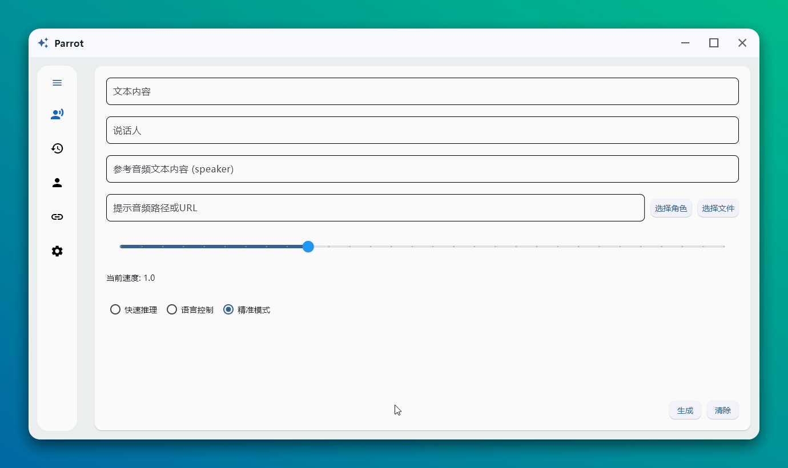
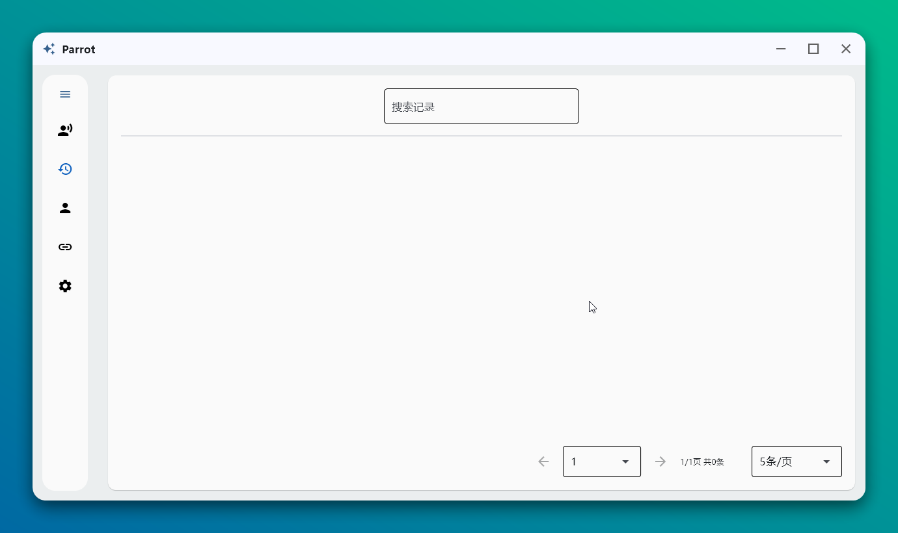
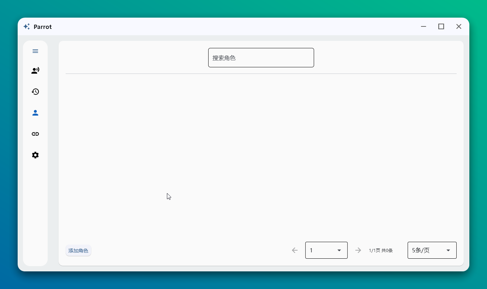
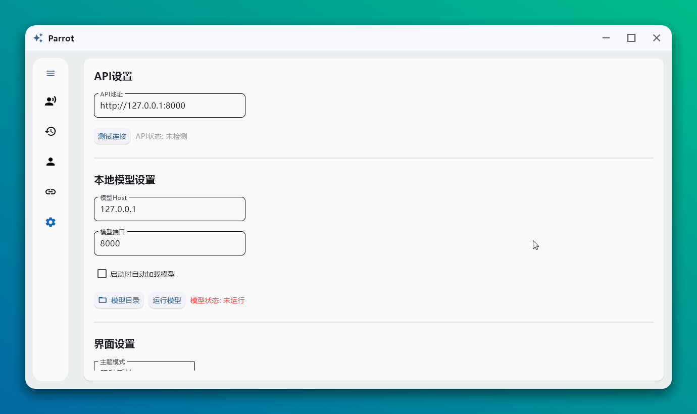
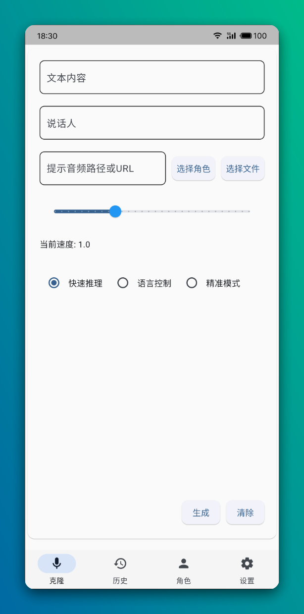

# Parrot

[English](./README_en.md) | 简体中文

使用`flet`UI框架，基于`CosyVoice2-0.5B`模型的多角色语音克隆项目。

> 模型运行要求：至少 6GB 可用 RAM 或 GPU 内存， 至少10GB存储空间

## 主要功能

- 支持本地音频文件或 URL 直接克隆
- 预设角色一键切换音色
- 历史记录参数快速复用
- 支持模型自动加载

## 使用指南

### 开箱即用
1. 在 [Releases](https://github.com/HG-ha/Parrot/releases) 中下载对应平台版本，运行并解压
2. 模型下载二选一
    - 手动下载模型文件
        1. 下载地址
            - v1.0.0及之前版本
              - [百度网盘](https://pan.baidu.com/s/1731fksU1zH0YPAU1Bfgx-Q?pwd=y67e) 提取码: y67e
              - [Onedrive](https://1drv.ms/u/c/29eaba19ed77d64a/EWa8OyXOLb1KoCYX-6lJHeUBHKiI4VzKmnRyFf8k0yumYQ?e=eGFDsv)
              - [Onedrive国内下载地址](https://dlink.host/1drv/aHR0cHM6Ly8xZHJ2Lm1zL3UvYy8yOWVhYmExOWVkNzdkNjRhL0VXYThPeVhPTGIxS29DWVgtNmxKSGVVQkhLaUk0VnpLbW5SeUZmOGsweXVtWVE/ZT1tbGFGemg)
            - v1.0.1版本
              - windows系统
                - [百度网盘](https://pan.baidu.com/s/1PMYoXbx19KHab6ol-pjUcg?pwd=7yh3) 提取码: 7yh3
                - [Onedrive](https://1drv.ms/u/c/29eaba19ed77d64a/EVWpMPlL5a5Nr-F3pNlqS7gBgSM39vB-10VYUYH8-2lpLw?e=sEEgNt)
                - [Onedrive国内下载地址](https://dlink.host/1drv/aHR0cHM6Ly8xZHJ2Lm1zL3UvYy8yOWVhYmExOWVkNzdkNjRhL0VWV3BNUGxMNWE1TnItRjNwTmxxUzdnQmdTTTM5dkItMTBWWVVZSDgtMmxwTHc/ZT16Z0tVenE)
              - linux系统
                - [百度网盘](https://pan.baidu.com/s/1PMYoXbx19KHab6ol-pjUcg?pwd=7yh3) 提取码: 7yh3
                - [Onedrive](https://1drv.ms/u/c/29eaba19ed77d64a/EbQoqalTz-9PuoHyBWYFjL4B55QbvNfh0u4gdHo4mLgPZA?e=nsf0Li)
                - [Onedrive国内下载地址](https://dlink.host/1drv/aHR0cHM6Ly8xZHJ2Lm1zL3UvYy8yOWVhYmExOWVkNzdkNjRhL0ViUW9xYWxUei05UHVvSHlCV1lGakw0QjU1UWJ2TmZoMHU0Z2RIbzRtTGdQWkE/ZT1kSkR1MUo)
        2. 运行程序后点击 `设置` - `模型目录`，将模型文件解压至此
            > 或将下载的文件移动到该路径下，然后点击 `运行模型` - `自动下载`，程序将自动解压并运行模型

    - 自动下载模型文件（偶尔较慢，但很方便）
        > 启动后，点击设置界面中的“运行模型”按钮，自动下载模型文件

3. windows下双击 `Parrot.exe`，linux下 `./parrot`

### 参数说明
1. 文本内容：需要朗读的内容
2. 说话人：选择预设的说话人（选择角色），或自定义说话人
3. 提示音频：一段干净的人声音频文件，或可访问的文件URL
4. 提示词（语言控制）：用于控制朗读该段文字的语言、例如：**请使用四川话朗读这段话**
5. 参考音频文本内容（精准模式）：`提示音频` 的实际文本内容。例如你选择的音频的内容是 “你好，欢迎使用Parrot”。这里就应该填写 “你好，欢迎使用Parrot”

### 模式区别
1. 快速推理：直接使用音频进行语音生成，效果较为普通
2. 语言控制：效果与`1`类似，但支持通过提示词来更改实际生成的语言，like "请使用四川话朗读这段话"
3. 精准模式：效果很好，但需要提供`提示音频`的实际文本内容


### 单独在平台上运行模型API（模型分离场景）
>由于接口未做鉴权，请在内网环境下使用
- Windows系统
  1. 下载对应版本的windows模型并解压
  2. 切换到模型路径，在cmd中执行 `python.exe fastapi_app.py`

- Linux系统
  1. 下载对应版本的linux模型并解压
  2. 切换到模型路径，在终端中执行 `./bin/python3 fastapi_app.py`

### 部署开发环境

1. **克隆项目**
    ```bash
    git clone --recursive https://github.com/HG-ha/Parrot.git
    ```

2. **安装依赖**
   - 安装 [Miniconda](https://docs.anaconda.com/miniconda/install/#quick-command-line-install)（或其他环境管理工具）
   - 配置环境：
        ```bash
        # 创建并激活环境
        conda create -n Parrot -y python=3.10
        conda activate Parrot

        # 安装依赖
        pip install -r requirements.txt -i https://mirrors.aliyun.com/pypi/simple/
        ```

3. **运行**
    ```bash
    # 在桌面运行
    flet run

    # 在浏览器中运行
    flet run -w --host 127.0.0.1 -p 8000
    ```

### 发布到其他平台
  1. 建议不要在系统中安装flutter sdk，这会导致flet编译无响应。在编译时flet会自动安装flutter sdk
  2. 正确安装flutter sdk的依赖工具
  3. 克隆项目
      ```bash
      git clone https://github.com/HG-ha/Parrot.git
      cd Parrot
      ```
  4. 安装依赖
      ```bash
      pip install -r requirements.txt -i https://mirrors.aliyun.com/pypi/simple/
      ```
  5. 进行编译
      - windows：`flet build windows`
      - linux：`flet build linux`
      - macos：`flet build macos`
      - android：`flet build apk`


### 在不同环境下

## 界面展示

### 主页面
<div align="center">
  
  <p><em>主页界面 - 提供语音克隆核心功能和角色切换</em></p>
</div>

### 历史记录
<div align="center">
  
  <p><em>历史记录页面 - 查看和复用以往的语音克隆参数</em></p>
</div>

### 角色管理
<div align="center">
  
  <p><em>角色管理界面 - 添加、编辑和管理预设角色</em></p>
</div>

### 系统配置
<div align="center">
  
  <p><em>设置界面 - 调整系统参数和模型配置</em></p>
</div>

### 手机
<div align="center">
  
  <p><em>手机主页</em></p>
</div>