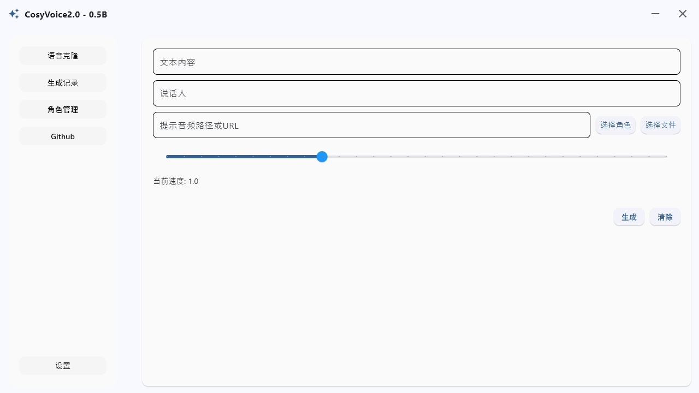
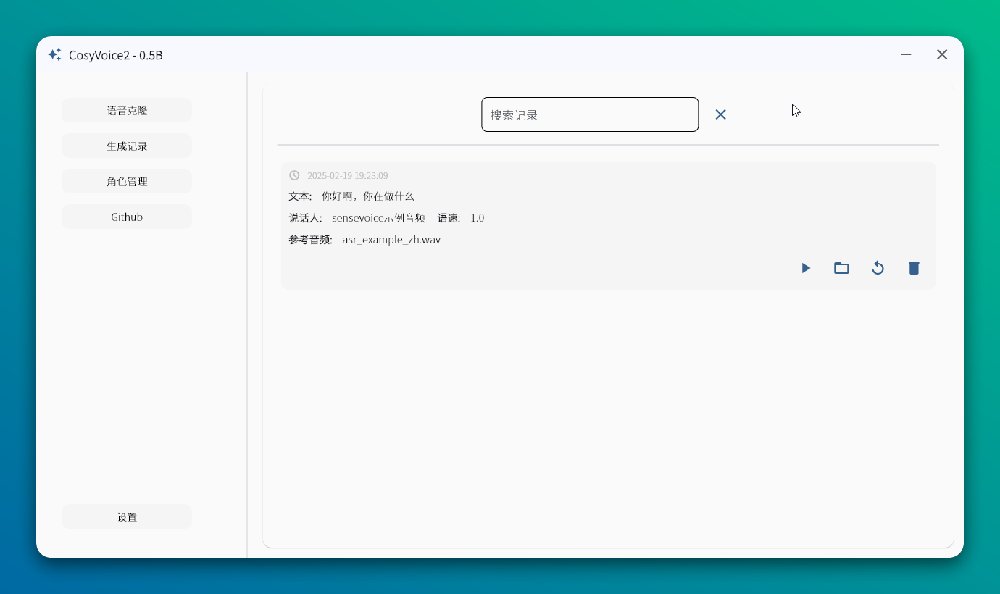
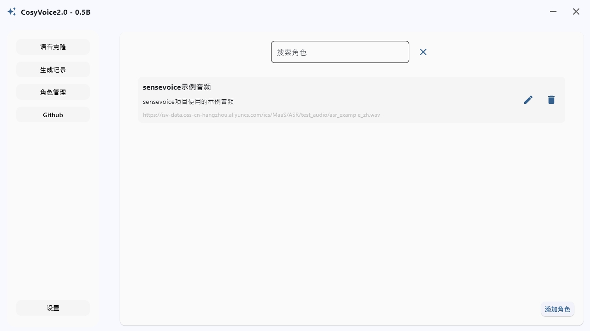
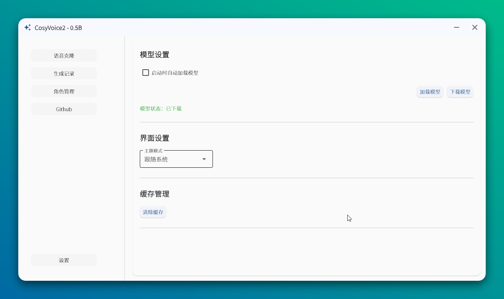

# CosyVoice2.0-0.5B Role Management System

English | [简体中文](./README.md)

Multi-role voice cloning project based on CosyVoice2-0.5B.

> System Requirements: Minimum 4GB available RAM or GPU memory

## Key Features

- Direct voice cloning from local audio files or URLs
- One-click voice switching with preset characters
- Quick parameter reuse from history records
- Optional automatic model loading

## Getting Started

### Environment Setup

1. **Clone Repository**
    ```bash
    git clone --recursive https://github.com/HG-ha/CosyVoice_Role_management.git
    ```

2. **Install Dependencies**
   - Install [Miniconda](https://docs.anaconda.com/miniconda/install/#quick-command-line-install)
   - Configure environment:
        ```bash
        # Create and activate environment
        conda create -n cosyvoice -y python=3.10
        conda activate cosyvoice

        # Install pynini (WeTextProcessing dependency)
        conda install -y -c conda-forge pynini==2.1.5

        # Install other dependencies
        pip install -r requirements.txt -i https://mirrors.aliyun.com/pypi/simple/ --trusted-host=mirrors.aliyun.com
        ```

### Model Download

You can download through the settings interface after startup, or use the following code:

```python
from modelscope import snapshot_download
snapshot_download('iic/CosyVoice2-0.5B', local_dir='pretrained_models/CosyVoice2-0.5B')
```

## Interface Preview

### Home


### History


### Role Management


### Settings
