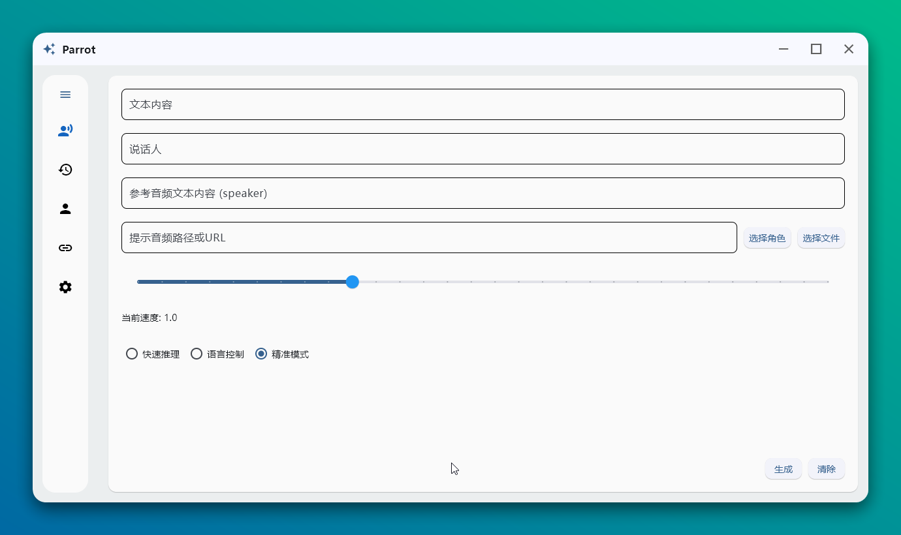
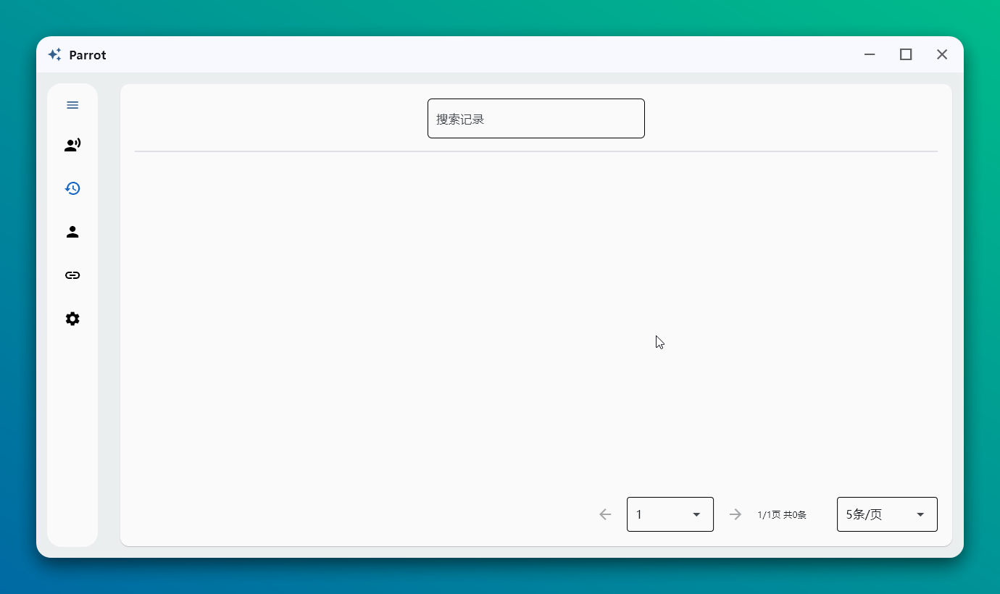
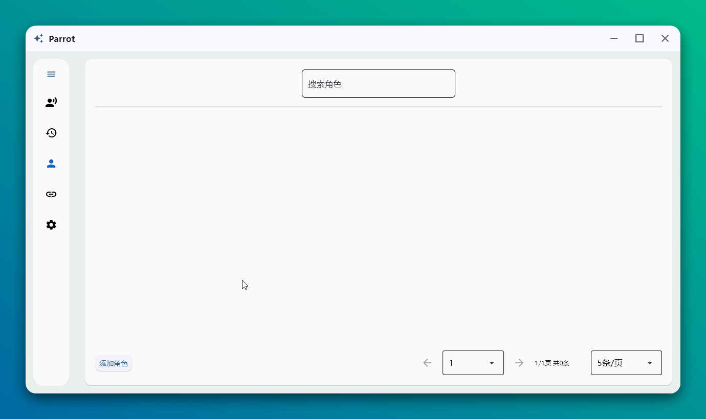

# Parrot

English | [简体中文](./README.md)

A multi-role voice cloning project based on the `CosyVoice2-0.5B` model using the `flet` UI framework.

> Model Requirements: At least 6GB available RAM or GPU memory, at least 10GB storage space

## Key Features

- Support for local audio files or URL direct cloning
- One-click voice switching with preset characters
- Quick parameter reuse from history
- Automatic model loading support

## User Guide

### Quick Start
1. Download the corresponding platform version from [Releases](https://github.com/HG-ha/Parrot/releases), run and extract
2. Choose one of two methods to download the model
    - Manual download
        1. Download links
            - [Baidu Netdisk](https://pan.baidu.com/s/1731fksU1zH0YPAU1Bfgx-Q?pwd=y67e) Code: y67e
            - [Onedrive](https://1drv.ms/u/c/29eaba19ed77d64a/EWa8OyXOLb1KoCYX-6lJHeUBHKiI4VzKmnRyFf8k0yumYQ?e=eGFDsv)
            - [Onedrive China Mirror](https://dlink.host/1drv/aHR0cHM6Ly8xZHJ2Lm1zL3UvYy8yOWVhYmExOWVkNzdkNjRhL0VXYThPeVhPTGIxS29DWVgtNmxKSGVVQkhLaUk0VnpLbW5SeUZmOGsweXVtWVE/ZT1tbGFGemg)
        2. After running the program, click `Settings` - `Model Directory`, extract the model files here
            > Or move the downloaded files to this path, then click `Run Model` - `Auto Download`, the program will automatically extract and run the model

    - Automatic download (occasionally slow but convenient)
        > After startup, click the "Run Model" button in settings for automatic model download

3. Double-click Parrot.exe to run

### Parameter Description
1. Text Content: Content to be read
2. Speaker: Choose a preset speaker (character) or customize one
3. Prompt Audio: A clean voice audio file or accessible file URL
4. Prompt Text (Language Control): Controls the language of reading, e.g., **"Please read this in British accent"**
5. Reference Audio Text Content (Precise Mode): The actual text content of the `Prompt Audio`. For example, if your chosen audio says "Hello, welcome to Parrot", you should enter "Hello, welcome to Parrot" here

### Mode Differences
1. Quick Inference: Directly generates speech using audio, with ordinary results
2. Language Control: Similar to `1`, but supports language modification through prompt text
3. Precise Mode: Excellent results but requires the actual text content of the `Prompt Audio`

### Development Environment Setup

1. **Clone Project**
    ```bash
    git clone --recursive https://github.com/HG-ha/Parrot.git
    ```

2. **Install Dependencies**
   - Install [Miniconda](https://docs.anaconda.com/miniconda/install/#quick-command-line-install) (or other environment management tools)
   - Configure environment:
        ```bash
        # Create and activate environment
        conda create -n Parrot -y python=3.10
        conda activate Parrot

        # Install dependencies
        pip install -r requirements.txt -i https://mirrors.aliyun.com/pypi/simple/
        ```

3. **Run**
    ```bash
    # Run on desktop
    flet run

    # Run in browser
    flet run -w --host 127.0.0.1 -p 8000
    ```

### Deploy to Other Platforms
  1. Avoid installing flutter sdk in the system as it may cause flet compilation to become unresponsive. Flet will automatically install flutter sdk during compilation
  2. Correctly install flutter sdk dependencies
  3. Clone project
      ```bash
      git clone https://github.com/HG-ha/Parrot.git
      cd Parrot
      ```
  4. Install dependencies
      ```bash
      pip install -r requirements.txt -i https://mirrors.aliyun.com/pypi/simple/
      ```
  5. Compile
      - windows: `flet build windows`
      - linux: `flet build linux`
      - macos: `flet build macos`
      - android: `flet build apk`

## Interface Display

### Main Page
<div align="center">
  
  <p><em>Main Interface - Provides core voice cloning functionality and character switching</em></p>
</div>

### History
<div align="center">
  
  <p><em>History Page - View and reuse previous voice cloning parameters</em></p>
</div>

### Role Management
<div align="center">
  
  <p><em>Role Management Interface - Add, edit, and manage preset characters</em></p>
</div>

### System Configuration
<div align="center">
  
  <p><em>Settings Interface - Adjust system parameters and model configuration</em></p>
</div>
