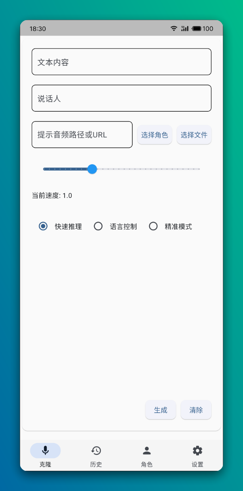

# Parrot

English | [简体中文](./README.md)

A multi-role voice cloning project using the `flet` UI framework, based on the `CosyVoice2-0.5B` model.

> Model Requirements: At least 6GB available RAM or GPU memory, at least 10GB storage space

## Main Features

- Support local audio files or URL direct cloning
- Preset character voice switching with one click
- Quick reuse of historical parameters
- Support automatic model loading

## User Guide

### Quick Start
1. Download the corresponding platform version from [Releases](https://github.com/HG-ha/Parrot/releases), run and extract
2. Choose one method to download the model
    - Manual download model files
        1. Download links
            - For v1.0.0 and earlier versions
              - [Baidu Netdisk](https://pan.baidu.com/s/1731fksU1zH0YPAU1Bfgx-Q?pwd=y67e) Code: y67e
              - [Onedrive](https://1drv.ms/u/c/29eaba19ed77d64a/EWa8OyXOLb1KoCYX-6lJHeUBHKiI4VzKmnRyFf8k0yumYQ?e=eGFDsv)
              - [Onedrive China Mirror](https://dlink.host/1drv/aHR0cHM6Ly8xZHJ2Lm1zL3UvYy8yOWVhYmExOWVkNzdkNjRhL0VXYThPeVhPTGIxS29DWVgtNmxKSGVVQkhLaUk0VnpLbW5SeUZmOGsweXVtWVE/ZT1tbGFGemg)
            - For v1.0.1 version
              - Windows system
                - [Baidu Netdisk](https://pan.baidu.com/s/1PMYoXbx19KHab6ol-pjUcg?pwd=7yh3) Code: 7yh3
                - [Onedrive](https://1drv.ms/u/c/29eaba19ed77d64a/EVWpMPlL5a5Nr-F3pNlqS7gBgSM39vB-10VYUYH8-2lpLw?e=sEEgNt)
                - [Onedrive China Mirror](https://dlink.host/1drv/aHR0cHM6Ly8xZHJ2Lm1zL3UvYy8yOWVhYmExOWVkNzdkNjRhL0VWV3BNUGxMNWE1TnItRjNwTmxxUzdnQmdTTTM5dkItMTBWWVVZSDgtMmxwTHc/ZT16Z0tVenE)
              - Linux system
                - [Baidu Netdisk](https://pan.baidu.com/s/1PMYoXbx19KHab6ol-pjUcg?pwd=7yh3) Code: 7yh3
                - [Onedrive](https://1drv.ms/u/c/29eaba19ed77d64a/EbQoqalTz-9PuoHyBWYFjL4B55QbvNfh0u4gdHo4mLgPZA?e=nsf0Li)
                - [Onedrive China Mirror](https://dlink.host/1drv/aHR0cHM6Ly8xZHJ2Lm1zL3UvYy8yOWVhYmExOWVkNzdkNjRhL0ViUW9xYWxUei05UHVvSHlCV1lGakw0QjU1UWJ2TmZoMHU0Z2RIbzRtTGdQWkE/ZT1kSkR1MUo)
        2. After running the program, click `Settings` - `Model Directory` and extract the model files there
            > Or move the downloaded files to this path, then click `Run Model` - `Auto Download`, the program will automatically extract and run the model

    - Auto download model files (occasionally slow but convenient)
        > After startup, click the "Run Model" button in the settings interface to automatically download model files

3. On Windows, double-click `Parrot.exe`; on Linux, run `./parrot`

### Parameter Description
1. Text Content: Content to be read
2. Speaker: Choose preset speaker (character selection) or custom speaker
3. Prompt Audio: A clean human voice audio file or accessible file URL
4. Prompt Text (Language Control): Used to control the language of reading the text, e.g., **"Please read this in Sichuan dialect"**
5. Reference Audio Text Content (Accurate Mode): The actual text content of the `Prompt Audio`. For example, if your chosen audio says "Hello, welcome to Parrot", you should enter "Hello, welcome to Parrot" here

### Mode Differences
1. Quick Inference: Directly use audio for voice generation, with ordinary results
2. Language Control: Similar to `1`, but supports changing the actual generated language through prompt text
3. Accurate Mode: Very good results, but requires the actual text content of the `Prompt Audio`

### Running Model API Separately (Model Separation Scenario)
>Due to no authentication on the interface, please use in an internal network environment
- Windows System
  1. Download and extract the corresponding Windows model version
  2. Switch to the model path, execute `python.exe fastapi_app.py` in cmd

- Linux System
  1. Download and extract the corresponding Linux model version
  2. Switch to the model path, execute `./bin/python3 fastapi_app.py` in terminal

### Development Environment Setup

1. **Clone Project**
    ```bash
    git clone --recursive https://github.com/HG-ha/Parrot.git
    ```

2. **Install Dependencies**
   - Install [Miniconda](https://docs.anaconda.com/miniconda/install/#quick-command-line-install) (or other environment management tools)
   - Configure environment:
        ```bash
        # Create and activate environment
        conda create -n Parrot -y python=3.10
        conda activate Parrot

        # Install dependencies
        pip install -r requirements.txt -i https://mirrors.aliyun.com/pypi/simple/
        ```

3. **Run**
    ```bash
    # Run on desktop
    flet run

    # Run in browser
    flet run -w --host 127.0.0.1 -p 8000
    ```

### Publishing to Other Platforms
  1. It's recommended not to install Flutter SDK in the system as it may cause flet compilation to become unresponsive. Flet will automatically install Flutter SDK during compilation
  2. Correctly install Flutter SDK dependencies
  3. Clone project
      ```bash
      git clone https://github.com/HG-ha/Parrot.git
      cd Parrot
      ```
  4. Install dependencies
      ```bash
      pip install -r requirements.txt -i https://mirrors.aliyun.com/pypi/simple/
      ```
  5. Compile
      - windows: `flet build windows`
      - linux: `flet build linux`
      - macos: `flet build macos`
      - android: `flet build apk`

## Interface Display

### Main Interface
<div align="center">
  
  <p><em>Main Interface - Provides core voice cloning functionality and character switching</em></p>
</div>

### History
<div align="center">
  
  <p><em>History Page - View and reuse previous voice cloning parameters</em></p>
</div>

### Character Management
<div align="center">
  
  <p><em>Character Management Interface - Add, edit, and manage preset characters</em></p>
</div>

### System Configuration
<div align="center">
  
  <p><em>Settings Interface - Adjust system parameters and model configuration</em></p>
</div>

### phone
<div align="center">
  
  <p><em>Home</em></p>
</div>